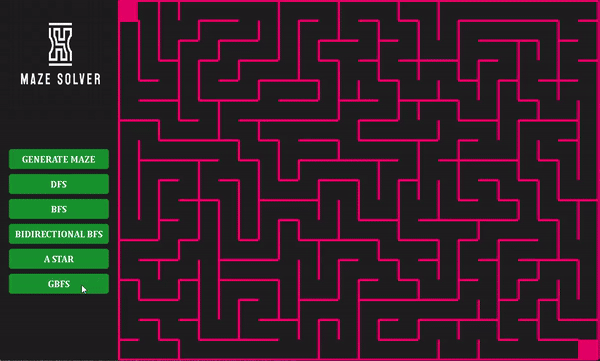

# [PYGAME] Maze Generator and Solver

<p align="center">
  <br/>
  <i>Maze Demo</i>
</p>

## Introduction
This Python project uses **Pygame** to generate and solve mazes. It demonstrates practical applications of **Data Structures** and **Algorithms** by implementing various Searching techniques.

## Features
With this code, you can:
1. **Generate a Maze:** Click on the **Generate Maze** button to create a randomized maze (**Note**: The maze is generated by Backtracking Algorithm)
2. **Solve the Maze:** Choose one of the algorithms to solve the maze by clicking on the corresponding button:
   - **BFS:** Solve the maze using Breadth-First Search.
   - **DFS:** Solve the maze using Depth-First Search.
   - **Bidirectional BFS:** Solve the maze using Bidirectional Breadth-First Search.
   - **A Star:** Solve the maze using A* Heuristic Search.
   - **GBFS:** Solve the maze using Greedy Best-First Search.

## Requirements
- **Python 3.11**
- **Pygame** (Install with `pip install pygame`)

## Usage
1. Clone this repository.
2. Install the required dependencies.
3. Run the main script:
   ```bash
   python main.py
